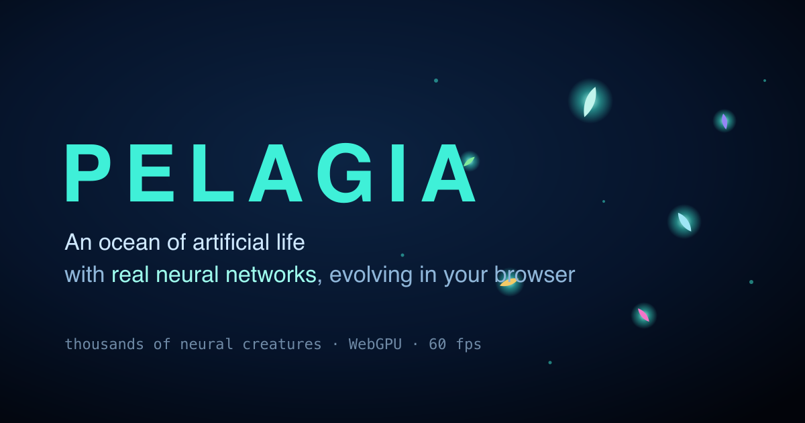

# 🌊 PELAGIA

**An ocean of artificial life that runs 100% in your browser.**

### ▶ Live demo: **[pelagia.phaino.dev](https://pelagia.phaino.dev)**

Thousands of creatures, each with a _real_ neural network (not scripted), perceive
their world, eat, reproduce and mutate — and **evolve by natural selection before
your eyes**. In minutes, predators, fleeing schools and collective behaviours
emerge on their own, with nobody programming them. Click any creature to watch its
neural brain firing in real time, and share your exact ocean with a URL.

> _ALIEN for everyone, in a browser tab._

<p align="center">
  <a href="https://pelagia.phaino.dev">
    
  </a>
</p>

---

> **Status:** the full ocean is live — GPU simulation of thousands of evolving
> neural creatures, a real-time brain inspector, lineage explorer + family tree,
> god mode, share-by-URL, procedural creature art and a touch/mobile-ready UI. It
> falls back to a reduced CPU version where WebGPU isn't available.

## Quick start

```bash
pnpm install
pnpm dev        # http://localhost:5173
```

Other scripts:

```bash
pnpm test       # run the test suite (Vitest)
pnpm check      # typecheck + lint + format check + tests
pnpm build      # static production build → dist/
```

## How it works (the short version)

- **Real brains.** Every creature evaluates its own fixed-topology neural network;
  behaviour is never scripted. The network weights live in its genome.
- **Real evolution.** Creatures gain energy by eating, spend it by living and
  moving, reproduce with mutation when they have enough, and die when they run out.
  Fitness is implicit — whoever survives, reproduces.
- **Built to scale.** The simulation runs on the GPU via WebGPU compute, with a
  spatial grid for neighbour queries, so thousands of creatures can think and move
  at 60 fps. A CPU reference implementation in TypeScript serves as the correctness
  oracle.
- **Reproducible.** Seed + parameters define the ocean, so you can share it.

## Tech

TypeScript · WebGPU (WGSL compute + render) · Vite · Vitest. No backend, no
install, no per-use cost — it all runs on your machine.

## License

PELAGIA is free software under the **GNU Affero General Public License v3.0 or
later** (AGPL-3.0) — see [`LICENSE`](./LICENSE). You're free to use, study, share
and modify it; but any modified or hosted/network version you distribute must also
be released as open source under the AGPL. This keeps PELAGIA open and prevents it
from being taken proprietary.

Copyright © 2026 bastian9819
